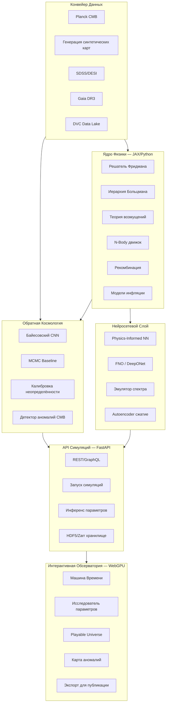

# ARCHEON: Вычислительная Платформа для Симуляции и Исследования Ранней Вселенной

**(от греч. ἀρχή — начало, первопричина)**

> Сопутствующие документы: [KNOWLEDGE.md](KNOWLEDGE.md) — база знаний (все термины, формулы, концепции) | [INSTRUCTIONS.md](INSTRUCTIONS.md) — инструкции для LLM-агентов

**Обзор:** ARCHEON — открытая вычислительная платформа, объединяющая строгую физику, нейросетевой вывод космологических параметров, обнаружение аномалий в [CMB](KNOWLEDGE.md#cmb), интерактивную [WebGPU](KNOWLEDGE.md#webgpu)-обсерваторию и движок обратной космологии. Цель — стать новым стандартом на стыке космологии, машинного обучения и интерактивных научных инструментов, с прямым путём к публикации на arXiv.

---

## Стратегическое позиционирование

### Что уже существует (и повторять не стоит)

- **Большие симуляции**: [IllustrisTNG](KNOWLEDGE.md#illustristng), Millennium Simulation — суперкомпьютерные проекты, недоступные одиночке
- **Анализ CMB**: миссия [Planck](KNOWLEDGE.md#planck) — завершённая, данные открыты, но инструменты монолитны
- **Звёздные каталоги**: [Gaia](KNOWLEDGE.md#gaia) — данные есть, но нет интерактивных инструментов анализа
- **Космологические коды**: [CLASS](KNOWLEDGE.md#class), [CAMB](KNOWLEDGE.md#camb) — точные, но медленные и неинтерактивные

### Где реальный шанс сделать НОВОЕ

Большие коллаборации не обгнать в вычислениях. Но можно победить в:

1. **Скорости** — нейросетевые суррогаты дают результат за миллисекунды вместо часов
2. **Новых комбинациях** — единая платформа: физика + ML + интерактив + воспроизводимость
3. **Удобстве инструмента** — от параметров до публикации в один клик
4. **Идеях** — обратная космология + поиск аномалий + сжатие вселенной в [latent space](KNOWLEDGE.md#latent-space)

### Путь к публикации и признанию

- GitHub-репозиторий, который выглядит как research project
- Один сильный результат: восстановление параметров за миллисекунды с точностью, близкой к [MCMC](KNOWLEDGE.md#mcmc)
- Сравнение с классическими методами (MCMC vs наша модель) — **ключ к публикации**
- Preprint на arXiv + демо-сайт + PyPI-пакет

---

## Архитектура ARCHEON



---

## Модуль 1: Ядро Физики (Physics Core)

Замена случайных данных реальными космологическими уравнениями на [JAX](KNOWLEDGE.md#jax) (GPU-ускорение + автодифференцирование).

### Уравнения Фридмана

[Уравнения Фридмана](KNOWLEDGE.md#friedmann-equations) — центральные уравнения космологии, описывающие расширение Вселенной:

$$ H^2(a) = H_0^2 \left[ \frac{\Omega_r}{a^4} + \frac{\Omega_m}{a^3} + \Omega_\Lambda \right] $$

```python
import jax.numpy as jnp
from jax import jit

@jit
def hubble_parameter(a, H0, Omega_m, Omega_r, Omega_lambda):
    """H(a) = H0 * sqrt(Omega_r/a^4 + Omega_m/a^3 + Omega_lambda)"""
    return H0 * jnp.sqrt(Omega_r / a**4 + Omega_m / a**3 + Omega_lambda)
```

Где [H0](KNOWLEDGE.md#h0) — постоянная Хаббла, [Omega_m](KNOWLEDGE.md#omega-m) — доля материи, [Omega_r](KNOWLEDGE.md#omega-r) — доля излучения, [Omega_Lambda](KNOWLEDGE.md#omega-lambda) — доля тёмной энергии, [a(t)](KNOWLEDGE.md#scale-factor) — масштабный фактор.

### Спектр мощности CMB

Угловой [спектр мощности](KNOWLEDGE.md#power-spectrum) CMB: [C_l](KNOWLEDGE.md#c-l) = <|a_lm|^2>

Разложение температурного поля по [сферическим гармоникам](KNOWLEDGE.md#spherical-harmonics):

$$ T(\theta, \phi) = \sum_l \sum_m a_{lm} Y_{lm}(\theta, \phi) $$

### Ключевые компоненты

- `archeon/physics/friedmann.py` — решатель [уравнений Фридмана](KNOWLEDGE.md#friedmann-equations), эволюция [масштабного фактора](KNOWLEDGE.md#scale-factor) a(t), H(a), расстояния
- `archeon/physics/boltzmann.py` — [иерархия Больцмана](KNOWLEDGE.md#boltzmann-hierarchy) для фотонов, [нейтрино](KNOWLEDGE.md#neutrinos), [барионов](KNOWLEDGE.md#baryonic-matter), [CDM](KNOWLEDGE.md#omega-cdm)
- `archeon/physics/perturbations.py` — космологическая [теория возмущений](KNOWLEDGE.md#perturbation-theory) (скалярные, тензорные моды), [спектр мощности P(k)](KNOWLEDGE.md#power-spectrum), [C_l](KNOWLEDGE.md#c-l)
- `archeon/physics/recombination.py` — [рекомбинация](KNOWLEDGE.md#recombination) по [Peebles](KNOWLEDGE.md#peebles-equation)/[Saha](KNOWLEDGE.md#saha-equation), [ионизационная история](KNOWLEDGE.md#ionization-history) xe(z)
- `archeon/physics/nbody.py` — Barnes-Hut / PM [N-body](KNOWLEDGE.md#nbody) симуляция [формирования структур](KNOWLEDGE.md#structure-formation)
- `archeon/physics/inflation.py` — модели [инфляции](KNOWLEDGE.md#inflation) (slow-roll, квадратичный потенциал, Starobinsky R^2)
- `archeon/physics/spherical_harmonics.py` — синтез/анализ [сферических гармоник](KNOWLEDGE.md#spherical-harmonics) через [healpy](KNOWLEDGE.md#healpy)

### Интеграция с CLASS/CAMB

Обёртка вокруг `classy` для валидации наших расчётов с точностью < 0.1%.

---

## Модуль 2: Обратная Космология (Inverse Cosmology Engine)

**Ключевая научная новизна проекта.** Классический подход: параметры -> симуляция -> вселенная. Мы делаем наоборот: наблюдаемая структура -> восстановление параметров.

### Постановка задачи

Дано: наблюдательные данные x (карта температурной анизотропии [CMB](KNOWLEDGE.md#cmb))

Найти: космологические параметры theta = {[Omega_m](KNOWLEDGE.md#omega-m), [Omega_Lambda](KNOWLEDGE.md#omega-lambda), [H0](KNOWLEDGE.md#h0), [sigma_8](KNOWLEDGE.md#sigma-8), [n_s](KNOWLEDGE.md#n-s)}

Задача: аппроксимировать [апостериорное распределение](KNOWLEDGE.md#posterior) p(theta | x)

### Архитектура Байесовского CNN

[Байесовский CNN](KNOWLEDGE.md#bayesian-cnn) — [CNN](KNOWLEDGE.md#cnn), который выдаёт не только предсказание, но и оценку неопределённости:

```python
class BayesianCosmologyCNN(nn.Module):
    """CNN-энкодер: вход — 2D проекция CMB карты, выход — mu(theta), sigma(theta)"""

    def forward(self, x):
        features = self.encoder(x)         # Conv слои -> извлечение признаков
        pooled = self.global_pool(features) # Глобальный пулинг
        mu = self.mu_head(pooled)           # Средние параметров
        log_sigma = self.sigma_head(pooled) # Логарифм неопределённости
        return mu, log_sigma
```

### Функция потерь

$$ L = \sum_i \left[\frac{(\theta_i^{true} - \mu_i)^2}{\sigma_i^2} + \log\sigma_i^2\right] $$

Первый член штрафует за неточность, второй — за чрезмерную неопределённость.

### Калибровка неопределённости

- [Monte Carlo Dropout](KNOWLEDGE.md#mc-dropout) — N прямых проходов с включённым dropout, оценка разброса
- [Deep Ensembles](KNOWLEDGE.md#deep-ensembles) — ансамбль из 5-10 независимо обученных моделей
- Метрики калибровки — [calibration error](KNOWLEDGE.md#calibration-error), [coverage probability](KNOWLEDGE.md#coverage-probability)

### Сравнение с классикой (ключ к публикации)

- [MCMC](KNOWLEDGE.md#mcmc) baseline ([emcee](KNOWLEDGE.md#emcee) / PyMC) — золотой стандарт, но медленный
- Наша модель: предсказание за миллисекунды
- Сравнение точности, калибровки, покрытия
- Валидация против опубликованных значений [Planck](KNOWLEDGE.md#planck)

### Компоненты

- `archeon/inverse/bayesian_cnn.py` — [Байесовский CNN](KNOWLEDGE.md#bayesian-cnn) энкодер
- `archeon/inverse/mcmc_baseline.py` — MCMC через [emcee](KNOWLEDGE.md#emcee) для сравнения
- `archeon/inverse/uncertainty.py` — [MC Dropout](KNOWLEDGE.md#mc-dropout), [Deep Ensembles](KNOWLEDGE.md#deep-ensembles), калибровка
- `archeon/inverse/evaluation.py` — [RMSE](KNOWLEDGE.md#rmse)(theta), [calibration error](KNOWLEDGE.md#calibration-error), [coverage](KNOWLEDGE.md#coverage-probability), сравнение с Planck

### Эксперименты

1. Синтетические данные -> Синтетическая валидация (proof of concept)
2. Синтетические данные -> Реальные данные ([domain gap](KNOWLEDGE.md#domain-shift) — главный вызов)
3. Устойчивость к шуму (degradation analysis)

---

## Модуль 3: Детектор Аномалий CMB (CMB Anomaly Detection)

**Открытые вопросы космологии**, на которые можно попытаться ответить:

- [Холодное пятно (Cold Spot)](KNOWLEDGE.md#cold-spot) — аномально холодная область в CMB, возможный след столкновения с другой вселенной
- [Негауссовские флуктуации](KNOWLEDGE.md#non-gaussianity) — отклонения от стандартной [LCDM](KNOWLEDGE.md#lcdm) модели
- **Нестандартные паттерны** — возможные следы мультивселенной, космических струн, топологических дефектов

### Подход

1. Обучить модель на стандартных ([LCDM](KNOWLEDGE.md#lcdm)) синтетических CMB-картах
2. Применить к реальным данным [Planck](KNOWLEDGE.md#planck)
3. Найти области, где реальные данные **статистически значимо** отклоняются от модели

### Методы

- [Autoencoder](KNOWLEDGE.md#autoencoder) — обучается реконструировать нормальные CMB-карты; высокая ошибка реконструкции = аномалия
- [Latent space](KNOWLEDGE.md#latent-space) анализ — проекция CMB в скрытое пространство, кластеризация, обнаружение выбросов
- **Статистические тесты** — сравнение распределений pixel-по-pixel, мультиполь-по-мультиполь

### Компоненты

- `archeon/anomaly/autoencoder.py` — Convolutional [Autoencoder](KNOWLEDGE.md#autoencoder) для CMB-карт
- `archeon/anomaly/latent_analysis.py` — анализ [скрытого пространства](KNOWLEDGE.md#latent-space), t-SNE/UMAP визуализация
- `archeon/anomaly/statistical_tests.py` — статистическая значимость аномалий
- `archeon/anomaly/cold_spot.py` — специализированный анализ [Cold Spot](KNOWLEDGE.md#cold-spot)

---

## Модуль 4: Сжатие Вселенной (Cosmological Compression)

Космологические данные огромны. Сжатие через [latent space](KNOWLEDGE.md#latent-space) может выявить, **какие параметры реально важны** для структуры Вселенной.

### Подход

- Обучить [VAE](KNOWLEDGE.md#vae) (Variational Autoencoder) на наборе симуляций с разными параметрами
- Исследовать latent space: какие оси соответствуют каким физическим параметрам
- Обнаружить скрытые связи между параметрами, которые не очевидны из уравнений

### Компоненты

- `archeon/compression/vae.py` — [VAE](KNOWLEDGE.md#vae) для космологических полей
- `archeon/compression/disentanglement.py` — анализ разделимости latent переменных
- `archeon/compression/interpretability.py` — интерпретация осей latent space в терминах физики

---

## Модуль 5: Нейросетевые Суррогаты (Neural Surrogate Layer)

Обучение нейронных суррогатных моделей на дорогих расчётах для мгновенных предсказаний.

### Эмулятор спектра CMB

Замена [CLASS](KNOWLEDGE.md#class) (~30 секунд на один расчёт) [нейросетевым эмулятором](KNOWLEDGE.md#emulator) (~1 мс):

- Обучающие данные: [Latin Hypercube Sampling](KNOWLEDGE.md#latin-hypercube-sampling) по 6 параметрам ([H0](KNOWLEDGE.md#h0), [Omega_b](KNOWLEDGE.md#omega-b), [Omega_cdm](KNOWLEDGE.md#omega-cdm), [n_s](KNOWLEDGE.md#n-s), [A_s](KNOWLEDGE.md#a-s), [tau_reio](KNOWLEDGE.md#tau-reio))
- Датасет: 10k-100k расчётов CLASS
- Архитектура: [DeepONet](KNOWLEDGE.md#deeponet) / MLP с residual connections
- Валидация: < 0.1% ошибки относительно CLASS

### Fourier Neural Operator

[FNO](KNOWLEDGE.md#fno) — предсказание [формирования крупномасштабной структуры](KNOWLEDGE.md#structure-formation) из начальных условий:

- Вход: начальное поле плотности ([z](KNOWLEDGE.md#redshift)=1100)
- Выход: финальное поле (z=0)
- Ускорение: ~1000x относительно [N-body](KNOWLEDGE.md#nbody)

### Physics-Informed Neural Networks

[PINN](KNOWLEDGE.md#pinn) для [уравнений Фридмана](KNOWLEDGE.md#friedmann-equations) — нейросеть, в функцию потерь которой встроены дифференциальные уравнения:

$$ L = L_{data} + \lambda \cdot L_{physics}, \quad L_{physics} = \frac{1}{N}\sum_i ||\mathcal{F}[\hat{u}(x_i)]||^2 $$

### Компоненты

- `archeon/ml/emulator.py` — [эмулятор](KNOWLEDGE.md#emulator) [C_l](KNOWLEDGE.md#c-l) спектра
- `archeon/ml/fno_structure.py` — [FNO](KNOWLEDGE.md#fno) для формирования структур
- `archeon/ml/pinn_friedmann.py` — [PINN](KNOWLEDGE.md#pinn) для уравнений Фридмана
- `archeon/ml/training.py` — универсальный тренировочный цикл с логированием и калибровкой

---

## Модуль 6: Конвейер Данных (Data Pipeline)

### Реальные данные

- `archeon/data/planck.py` — загрузка [Planck](KNOWLEDGE.md#planck) CMB карт ([HEALPix](KNOWLEDGE.md#healpix), Nside=2048) и power spectrum через ESA TAP
- `archeon/data/sdss.py` — каталоги галактик [SDSS](KNOWLEDGE.md#sdss) DR18 через CasJobs/SciServer API
- `archeon/data/gaia.py` — [Gaia](KNOWLEDGE.md#gaia) DR3 через astroquery
- `archeon/data/desi.py` — данные [барионных акустических осцилляций (BAO)](KNOWLEDGE.md#bao) [DESI](KNOWLEDGE.md#desi)
- `archeon/data/illustris.py` — API [IllustrisTNG](KNOWLEDGE.md#illustristng) для валидации N-body

### Генерация синтетических данных

Критически важный компонент для обучения inverse-моделей:

1. Сэмплируем theta из [априорного распределения](KNOWLEDGE.md#prior)
2. Генерируем теоретический [C_l](KNOWLEDGE.md#c-l) (через [CLASS](KNOWLEDGE.md#class) или [эмулятор](KNOWLEDGE.md#emulator))
3. Сэмплируем a_lm ~ Gaussian(0, C_l)
4. Трансформируем в карту через обратные [сферические гармоники](KNOWLEDGE.md#spherical-harmonics) ([healpy](KNOWLEDGE.md#healpy))

- `archeon/data/synthetic.py` — генерация синтетических CMB-карт
- `archeon/data/priors.py` — определение [априорных распределений](KNOWLEDGE.md#prior) параметров

### Версионирование

[DVC](KNOWLEDGE.md#dvc) (Data Version Control) для полной воспроизводимости каждого датасета и запуска.

---

## Модуль 7: Интерактивная Обсерватория (WebGPU)

[WebGPU](KNOWLEDGE.md#webgpu) для compute shaders, рендеринга миллионов частиц в реальном времени.

### Cosmic Time Machine (Машина Времени)

Слайдер по шкале времени (10^-36 с ... 13.8 млрд лет):
- Физическое состояние Вселенной на данном этапе
- 3D-визуализация плотности/температуры/структуры
- Ключевые физические процессы эпохи
- Остановка времени и изменение параметров

### Playable Universe (Управляемая Вселенная)

**Физически корректная симуляция, управляемая как sandbox:**

- Роль «бога»: меняешь фундаментальные константы
- Меняешь параметры [инфляции](KNOWLEDGE.md#inflation), плотность, [тёмную энергию](KNOWLEDGE.md#dark-energy)
- Видишь: возникает ли вообще структура? Формируются ли галактики?
- Одновременно: образовательный и научный инструмент

### Исследователь Параметров (Parameter Explorer)

- Слайдеры для [H0](KNOWLEDGE.md#h0), [Omega_m](KNOWLEDGE.md#omega-m), [Omega_Lambda](KNOWLEDGE.md#omega-lambda), [n_s](KNOWLEDGE.md#n-s), [sigma_8](KNOWLEDGE.md#sigma-8)
- Мгновенный пересчёт через нейросетевые суррогаты (~1 мс)
- Визуализация: спектр CMB, распределение плотности, формирование структур

### Карта Аномалий CMB

- Интерактивная [HEALPix](KNOWLEDGE.md#healpix) карта реальных данных [Planck](KNOWLEDGE.md#planck)
- Наложение результатов детектора аномалий
- Выделение [Cold Spot](KNOWLEDGE.md#cold-spot) и других статистически значимых областей

### Экспорт для Публикации

- Экспорт фигур в формате ApJ/MNRAS/A&A (matplotlib backend)
- Генерация LaTeX таблиц с параметрами
- BibTeX-запись для каждой симуляции

### Компоненты

- `web/src/engine/` — WebGPU renderer с compute shaders
- `web/src/components/TimeTraveler.tsx` — машина времени
- `web/src/components/PlayableUniverse.tsx` — sandbox режим
- `web/src/components/ParameterExplorer.tsx` — исследование параметров
- `web/src/components/AnomalyMap.tsx` — карта аномалий CMB
- `web/src/components/PublicationExport.tsx` — экспорт для журналов

---

## Модуль 8: Альтернативные Космологии

Возможность исследовать нестандартные модели:

- **Модифицированная гравитация**: [f(R)](KNOWLEDGE.md#f-r-gravity), [MOND](KNOWLEDGE.md#mond)-космология
- **Вариация фундаментальных констант**: alpha, G, c
- **Циклическая модель**: [Penrose CCC](KNOWLEDGE.md#penrose-ccc), Steinhardt-Turok
- **Бранная космология**
- **Дополнительные пространственные измерения**

[Модифицированное уравнение Фридмана для f(R)](KNOWLEDGE.md#f-r-gravity):

$$ H^2 = \frac{1}{3f'}\left[\frac{1}{2}(f'R - f) - 3H\dot{f'} + \kappa^2\rho\right] $$

```python
class AlternativeCosmology(BaseCosmology):
    def modified_friedmann(self, a, params):
        """Обобщённые уравнения Фридмана для f(R) гравитации."""
        ...
```

- `archeon/physics/alternative.py` — базовый класс + реализации

---

## Модуль 9: Академический Движок (Academic Output Engine)

### Автогенерация публикационных материалов

- `archeon/academic/latex_export.py` — LaTeX-фигуры и таблицы
- `archeon/academic/citation.py` — уникальный ID + BibTeX для каждой симуляции
- `archeon/academic/reproducibility.py` — полная запись параметров, кода, данных
- `archeon/academic/notebook_generator.py` — автогенерация Jupyter-ноутбуков

### Структура arXiv-статьи (готовый каркас)

**Название**: "Neural Inference of Cosmological Parameters from CMB Maps: A Real-Time Interactive Framework"

1. Introduction — проблема медленного [MCMC](KNOWLEDGE.md#mcmc), необходимость интерактивных инструментов
2. Related Work — [CLASS](KNOWLEDGE.md#class), [CAMB](KNOWLEDGE.md#camb), cosmopower, existing emulators
3. Methodology — [Байесовский CNN](KNOWLEDGE.md#bayesian-cnn), синтетическая генерация, калибровка неопределённости
4. Experiments — Synthetic->Synthetic, Synthetic->Real, noise robustness
5. Results — [RMSE](KNOWLEDGE.md#rmse), сравнение с MCMC и Planck published values, calibration
6. Discussion — [domain shift](KNOWLEDGE.md#domain-shift), limitations, future [LSS](KNOWLEDGE.md#lss) integration
7. Conclusion

---

## Модуль 10: API Симуляций (Simulation API)

[FastAPI](KNOWLEDGE.md#fastapi)-сервис для программного доступа к платформе:

- `archeon/api/main.py` — FastAPI приложение
- `archeon/api/routes/simulations.py` — запуск и управление симуляциями
- `archeon/api/routes/inference.py` — инференс параметров из CMB-карт
- `archeon/api/routes/anomalies.py` — поиск аномалий в загруженных данных
- `archeon/api/schemas.py` — Pydantic-модели

```python
@app.post("/inference/parameters")
async def infer_parameters(cmb_map: UploadFile):
    """Восстановление космологических параметров из CMB-карты.
    Возвращает theta с оценкой неопределённости."""
    ...

@app.post("/anomalies/detect")
async def detect_anomalies(cmb_map: UploadFile):
    """Поиск аномалий в CMB-карте.
    Возвращает карту аномалий с p-values."""
    ...
```

**Хранение результатов**: [HDF5](KNOWLEDGE.md#hdf5)/[Zarr](KNOWLEDGE.md#zarr) для эффективного хранения многомерных данных.

---

## Структура проекта (финальная)

```
archeon/
├── physics/                 # Ядро физики (JAX)
│   ├── friedmann.py
│   ├── boltzmann.py
│   ├── perturbations.py
│   ├── recombination.py
│   ├── nbody.py
│   ├── inflation.py
│   ├── spherical_harmonics.py
│   └── alternative.py
├── inverse/                 # Обратная космология
│   ├── bayesian_cnn.py
│   ├── mcmc_baseline.py
│   ├── uncertainty.py
│   └── evaluation.py
├── anomaly/                 # Детектор аномалий CMB
│   ├── autoencoder.py
│   ├── latent_analysis.py
│   ├── statistical_tests.py
│   └── cold_spot.py
├── compression/             # Сжатие вселенной
│   ├── vae.py
│   ├── disentanglement.py
│   └── interpretability.py
├── ml/                      # Нейросетевые суррогаты
│   ├── emulator.py
│   ├── fno_structure.py
│   ├── pinn_friedmann.py
│   └── training.py
├── data/                    # Конвейер данных
│   ├── planck.py
│   ├── synthetic.py
│   ├── priors.py
│   ├── sdss.py
│   ├── gaia.py
│   ├── desi.py
│   └── illustris.py
├── api/                     # FastAPI сервис
│   ├── main.py
│   ├── routes/
│   │   ├── simulations.py
│   │   ├── inference.py
│   │   └── anomalies.py
│   └── schemas.py
├── academic/                # Публикационный движок
│   ├── latex_export.py
│   ├── citation.py
│   ├── reproducibility.py
│   └── notebook_generator.py
├── config/                  # Космологические параметры
│   ├── planck2018.yaml
│   ├── wmap9.yaml
│   └── custom.yaml
├── tests/                   # Тесты
│   ├── test_friedmann.py
│   ├── test_boltzmann.py
│   ├── test_inverse.py
│   ├── test_anomaly.py
│   └── test_against_class.py
├── notebooks/               # Демо-ноутбуки
│   ├── 01_quickstart.ipynb
│   ├── 02_cmb_spectrum.ipynb
│   ├── 03_inverse_cosmology.ipynb
│   ├── 04_anomaly_detection.ipynb
│   ├── 05_structure_formation.ipynb
│   ├── 06_alternative_cosmologies.ipynb
│   └── 07_universe_compression.ipynb
├── experiments/             # Результаты экспериментов
│   ├── synthetic_validation/
│   ├── domain_gap/
│   └── noise_robustness/
web/                         # WebGPU Observatory (React + TypeScript)
├── src/
│   ├── engine/              # WebGPU compute + render
│   ├── components/          # React UI
│   │   ├── TimeTraveler.tsx
│   │   ├── PlayableUniverse.tsx
│   │   ├── ParameterExplorer.tsx
│   │   ├── AnomalyMap.tsx
│   │   └── PublicationExport.tsx
│   └── api/                 # Клиент к FastAPI
├── package.json
└── vite.config.ts
paper/                       # arXiv статья
├── main.tex
├── figures/
└── bibliography.bib
pyproject.toml
docker-compose.yml
dvc.yaml
PLAN.md                      # Этот файл
KNOWLEDGE.md                 # База знаний
INSTRUCTIONS.md              # Инструкции для LLM
```

---

## Стек технологий

- **Ядро физики**: Python 3.11+, [JAX](KNOWLEDGE.md#jax), jaxlib (GPU), SciPy, classy ([CLASS](KNOWLEDGE.md#class) wrapper), [healpy](KNOWLEDGE.md#healpy)
- **Обратная космология**: PyTorch, [emcee](KNOWLEDGE.md#emcee) ([MCMC](KNOWLEDGE.md#mcmc)), corner (визуализация [постериоров](KNOWLEDGE.md#posterior))
- **Нейросетевой слой**: PyTorch / JAX, DeepXDE ([PINNs](KNOWLEDGE.md#pinn)), neuraloperator ([FNO](KNOWLEDGE.md#fno))
- **Данные**: astroquery, [healpy](KNOWLEDGE.md#healpy), h5py, [zarr](KNOWLEDGE.md#zarr), [DVC](KNOWLEDGE.md#dvc)
- **API**: [FastAPI](KNOWLEDGE.md#fastapi), Pydantic, Celery (async tasks), Redis
- **Веб**: React 19, TypeScript, [WebGPU](KNOWLEDGE.md#webgpu) API, @react-three/fiber (fallback), Vite
- **DevOps**: Docker, docker-compose, GitHub Actions CI/CD
- **Академический**: Jinja2 (LaTeX шаблоны), matplotlib (pub-quality), nbformat

---

## Фазы реализации

### Фаза 1: Ядро физики и валидация (2 недели)

Реализация решателей [Фридмана](KNOWLEDGE.md#friedmann-equations) и [Больцмана](KNOWLEDGE.md#boltzmann-hierarchy) на [JAX](KNOWLEDGE.md#jax). [Сферические гармоники](KNOWLEDGE.md#spherical-harmonics) через [healpy](KNOWLEDGE.md#healpy). Валидация против [CLASS](KNOWLEDGE.md#class) с точностью < 0.1%. Конфиги Planck 2018. Тесты.

### Фаза 2: Конвейер данных + синтетическая генерация (1 неделя)

Интеграция с [Planck](KNOWLEDGE.md#planck), [SDSS](KNOWLEDGE.md#sdss), [Gaia](KNOWLEDGE.md#gaia) через API. Генерация синтетических CMB-карт (theta -> [C_l](KNOWLEDGE.md#c-l) -> a_lm -> карта). Настройка [DVC](KNOWLEDGE.md#dvc). Парсинг [HEALPix](KNOWLEDGE.md#healpix) карт.

### Фаза 3: Обратная космология — ядро (2 недели)

[Байесовский CNN](KNOWLEDGE.md#bayesian-cnn) для инференса параметров. [MCMC](KNOWLEDGE.md#mcmc) baseline через [emcee](KNOWLEDGE.md#emcee). [Monte Carlo Dropout](KNOWLEDGE.md#mc-dropout) и [Deep Ensembles](KNOWLEDGE.md#deep-ensembles). Эксперимент: Synthetic -> Synthetic валидация.

### Фаза 4: Обратная космология — валидация (1 неделя)

Эксперимент: Synthetic -> Real ([domain gap](KNOWLEDGE.md#domain-shift)). Noise robustness. Сравнение с MCMC и Planck published values. **Формирование главного результата для публикации.**

### Фаза 5: Детектор аномалий + сжатие (2 недели)

[Autoencoder](KNOWLEDGE.md#autoencoder) для CMB-карт. [Latent space](KNOWLEDGE.md#latent-space) анализ. Статистические тесты аномалий. [VAE](KNOWLEDGE.md#vae) для сжатия вселенной. Анализ [Cold Spot](KNOWLEDGE.md#cold-spot).

### Фаза 6: Нейросетевые суррогаты (2 недели)

[Эмулятор](KNOWLEDGE.md#emulator) CMB спектра (замена CLASS). [FNO](KNOWLEDGE.md#fno) для [формирования структур](KNOWLEDGE.md#structure-formation). Замер ускорения vs CLASS/[N-body](KNOWLEDGE.md#nbody). N-Body движок на JAX.

### Фаза 7: API и Observatory (2 недели)

[FastAPI](KNOWLEDGE.md#fastapi) backend с эндпоинтами inference/anomalies/simulations. [WebGPU](KNOWLEDGE.md#webgpu) frontend: Cosmic Time Machine, Playable Universe, Parameter Explorer, Anomaly Map, Publication Export.

### Фаза 8: Альтернативные космологии + академический движок (1 неделя)

[f(R) гравитация](KNOWLEDGE.md#f-r-gravity), вариация констант. LaTeX экспорт, BibTeX для симуляций, автогенерация ноутбуков.

### Фаза 9: Статья, документация, публикация (2 недели)

Написание arXiv preprint. PyPI пакет. Docker образы. README, API docs, tutorial notebooks. Демо-сайт.

---

## Известные вызовы

- **[Domain shift](KNOWLEDGE.md#domain-shift)**: синтетические данные vs реальные данные [Planck](KNOWLEDGE.md#planck) — главная проблема для inverse-моделей
- **Артефакты проекции**: [CMB](KNOWLEDGE.md#cmb) на сфере -> 2D проекция теряет информацию
- **Высокая размерность**: карты Nside=2048 содержат ~50M пикселей
- **Вычислительные ресурсы**: обучение на 100k синтетических картах требует GPU

---

## Что делает ARCHEON новым стандартом

1. **Обратная космология в реальном времени** — восстановление параметров за миллисекунды вместо часов [MCMC](KNOWLEDGE.md#mcmc), с калиброванной неопределённостью
2. **AI-детектор аномалий [CMB](KNOWLEDGE.md#cmb)** — систематический поиск отклонений от [LCDM](KNOWLEDGE.md#lcdm) в данных [Planck](KNOWLEDGE.md#planck), включая [Cold Spot](KNOWLEDGE.md#cold-spot)
3. **Сжатие вселенной** — обнаружение скрытых связей между космологическими параметрами через [latent space](KNOWLEDGE.md#latent-space)
4. **Playable Universe** — физически корректный sandbox, где можно менять фундаментальные константы и наблюдать последствия
5. **Нейросетевые суррогаты** — исследование пространства параметров в реальном времени без суперкомпьютера
6. **[WebGPU](KNOWLEDGE.md#webgpu) Observatory** — космологические симуляции в браузере без установки
7. **От симуляции до публикации** — автоматическая генерация фигур, таблиц, BibTeX, черновика статьи
8. **Открытый стандарт** — YAML-конфиги, версионированные данные, цитируемые результаты, воспроизводимость

---

## Первый шаг

Начинаем с трёх параллельных направлений:

1. `archeon/physics/friedmann.py` + `pyproject.toml` — фундамент физики
2. `archeon/data/synthetic.py` — генерация синтетических CMB-карт для обучения
3. `archeon/inverse/bayesian_cnn.py` — первая модель обратной космологии

Это даёт минимальный end-to-end pipeline: **генерация -> обучение -> инференс**, который уже можно валидировать и сравнивать с [MCMC](KNOWLEDGE.md#mcmc).

---

## Задачи реализации

| ID | Задача | Фаза | Статус |
|----|--------|------|--------|
| setup-project | Инициализация: pyproject.toml, структура директорий, git, зависимости | 1 | **done** |
| friedmann-solver | Решатель [уравнений Фридмана](KNOWLEDGE.md#friedmann-equations) на [JAX](KNOWLEDGE.md#jax): a(t), H(a), расстояния, возрасты | 1 | **done** |
| boltzmann-hierarchy | [Иерархия Больцмана](KNOWLEDGE.md#boltzmann-hierarchy): возмущения фотонов, [барионов](KNOWLEDGE.md#baryonic-matter), [CDM](KNOWLEDGE.md#omega-cdm), [нейтрино](KNOWLEDGE.md#neutrinos) | 1 | **done** |
| perturbation-engine | [Теория возмущений](KNOWLEDGE.md#perturbation-theory): скалярные/тензорные моды, [P(k)](KNOWLEDGE.md#power-spectrum), [C_l](KNOWLEDGE.md#c-l) | 1 | **done** |
| spherical-harmonics | Синтез/анализ [сферических гармоник](KNOWLEDGE.md#spherical-harmonics) CMB через [healpy](KNOWLEDGE.md#healpy) | 1 | **done** |
| class-validation | Валидация физического ядра против [CLASS](KNOWLEDGE.md#class)/[CAMB](KNOWLEDGE.md#camb) < 0.1% | 1 | pending |
| recombination | [Рекомбинация](KNOWLEDGE.md#recombination): [Saha](KNOWLEDGE.md#saha-equation)/[Peebles](KNOWLEDGE.md#peebles-equation), [ионизационная история](KNOWLEDGE.md#ionization-history) xe(z) | 1 | **done** |
| inflation-models | Модели [инфляции](KNOWLEDGE.md#inflation): slow-roll, Starobinsky R^2, примордиальный спектр | 1 | **done** |
| data-planck | Загрузка [Planck](KNOWLEDGE.md#planck) CMB карт ([HEALPix](KNOWLEDGE.md#healpix)) и power spectrum | 2 | **done** |
| data-synthetic | Генерация синтетических CMB-карт: theta -> [C_l](KNOWLEDGE.md#c-l) -> a_lm -> карта | 2 | **done** |
| data-catalogs | Интеграция [SDSS](KNOWLEDGE.md#sdss), [Gaia](KNOWLEDGE.md#gaia), [DESI](KNOWLEDGE.md#desi) через API | 2 | **done** |
| data-versioning | Настройка [DVC](KNOWLEDGE.md#dvc) для воспроизводимости | 2 | **done** |
| bayesian-cnn | [Байесовский CNN](KNOWLEDGE.md#bayesian-cnn) для инференса параметров из [CMB](KNOWLEDGE.md#cmb) | 3 | **done** |
| mcmc-baseline | [MCMC](KNOWLEDGE.md#mcmc) baseline через [emcee](KNOWLEDGE.md#emcee) для сравнения | 3 | **done** |
| uncertainty-calibration | [MC Dropout](KNOWLEDGE.md#mc-dropout), [Deep Ensembles](KNOWLEDGE.md#deep-ensembles), калибровка неопределённости | 3 | **done** |
| inverse-validation | Эксперименты: Synthetic->Synthetic, Synthetic->Real, noise robustness | 4 | **done** |
| inverse-comparison | Сравнение с MCMC и Planck published values (ключевой результат) | 4 | **done** |
| cmb-autoencoder | [Autoencoder](KNOWLEDGE.md#autoencoder) для CMB-карт (детектор аномалий) | 5 | **done** |
| anomaly-detection | Поиск аномалий: [Cold Spot](KNOWLEDGE.md#cold-spot), [негауссовость](KNOWLEDGE.md#non-gaussianity), статистические тесты | 5 | **done** |
| universe-compression | [VAE](KNOWLEDGE.md#vae) для сжатия, [latent space](KNOWLEDGE.md#latent-space) анализ, интерпретация | 5 | **done** |
| neural-emulator | [Эмулятор](KNOWLEDGE.md#emulator) CMB спектра: обучение на CLASS, предсказание C_l за ~1ms | 6 | **done** |
| fno-structure | [FNO](KNOWLEDGE.md#fno) для предсказания [формирования структур](KNOWLEDGE.md#structure-formation) | 6 | **done** |
| pinn-friedmann | [PINN](KNOWLEDGE.md#pinn) для уравнений Фридмана + универсальный тренировочный цикл | 6 | **done** |
| fastapi-service | [FastAPI](KNOWLEDGE.md#fastapi): inference, anomalies, simulations endpoints | 7 | **done** |
| webgpu-engine | [WebGPU](KNOWLEDGE.md#webgpu) renderer: compute shaders для частиц | 7 | **done** |
| cosmic-time-machine | Cosmic Time Machine UI: таймлайн Вселенной | 7 | **done** |
| playable-universe | Playable Universe: sandbox с изменением констант | 7 | **done** |
| parameter-explorer | Parameter Explorer: слайдеры + мгновенный пересчёт | 7 | **done** |
| anomaly-map | Интерактивная карта аномалий CMB | 7 | **done** |
| alternative-cosmologies | [f(R)](KNOWLEDGE.md#f-r-gravity), вариация констант, циклические модели | 8 | **done** |
| academic-engine | LaTeX экспорт, BibTeX, автогенерация ноутбуков | 8 | **done** |
| arxiv-paper | Написание arXiv preprint: Neural Inference of Cosmological Parameters | 9 | pending |
| docker-devops | Docker Compose, CI/CD, GitHub Actions | 9 | pending |
| documentation | README, API docs, tutorial notebooks, демо-сайт | 9 | pending |
